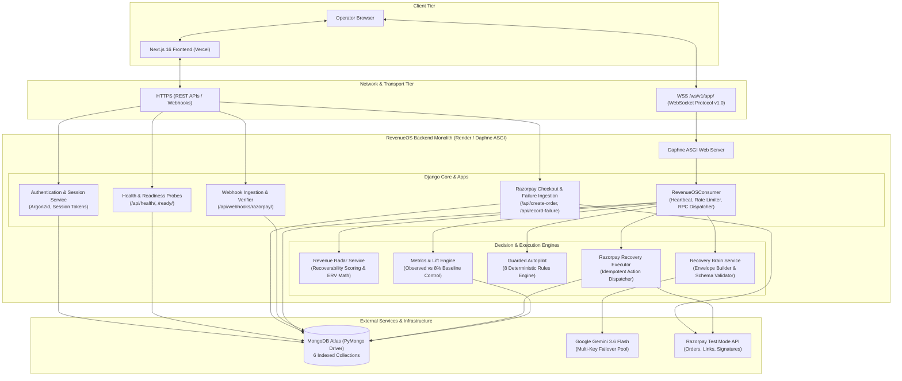
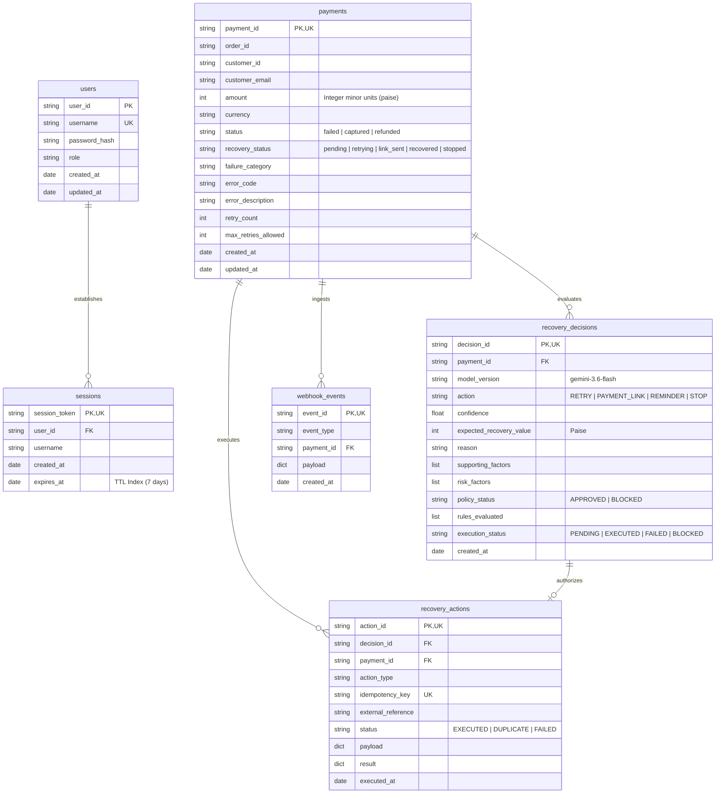

# RevenueOS

**AI-powered revenue recovery decision infrastructure for detecting at-risk revenue, selecting bounded recovery actions, and measuring recovery outcomes.**

RevenueOS is an intelligent revenue recovery and payment decision engine engineered for digital commerce. When customer payments fail, conventional systems either execute naive, repetitive retries that burn payment gateway fees and alienate customers, or abandon transactions entirely. RevenueOS introduces an auditable, multi-stage recovery architecture: it detects failed transactions in real time, computes deterministic Recoverability Scores and Expected Recovery Value (ERV) in integer minor units, orchestrates Google Gemini 3.6 Flash reasoning within a bounded decision context, validates every AI recommendation against an 8-rule deterministic policy engine (Guarded Autopilot), executes permitted recovery actions via Razorpay Test Mode, commits full audit trails to an immutable Decision Ledger, and measures recovery lift against an unguided baseline control.

---

## Deployment and Verification Status

| Component | Target Environment | Deployment Status | URL |
| :--- | :--- | :--- | :--- |
| **Frontend Application** | Vercel (Next.js 16 App Router) | Production Deployment | [Vercel Production](https://revenue-os-woad.vercel.app/) |
| **Backend Web Service** | Render (Django 5, Channels 4, Daphne ASGI) | Live Web Service | [Render Service](https://revenueos-backend-f81a.onrender.com/) |
| **Real-Time WebSocket** | Render ASGI Transport | Live Secure WebSocket | `wss://revenueos-backend-f81a.onrender.com/ws/v1/app/` |
| **Database Cluster** | MongoDB Atlas (M0 Free Tier) | Dedicated Production Replica Set | `mongodb+srv://...` (6 collections indexed) |
| **AI Reasoning Engine** | Google Gemini API (`gemini-3.6-flash`) | Live Multi-Key Failover Pool | Official Google GenAI Python SDK |
| **Payment Gateway** | Razorpay Standard Checkout | Active Test Mode | Server-side Orders, Signatures, Webhooks |
| **Source Code Repository** | GitHub | Public Repository | [Divyanshgupta2580/RevenueOS](https://github.com/Divyanshgupta2580/RevenueOS) |

*Note on Deployments: The frontend URL reflects the verified active Vercel production deployment. Because the backend is deployed on Render's free tier, the web service enters an idle state after 15 minutes of inactivity; initial cold-start requests may require 30 to 50 seconds to spin up.*

---

## 1. The Problem

Digital commerce platforms experience payment failure rates typically ranging between 5% and 20%. These failures stem from card issuer declines, insufficient balances, 3D-Secure drop-offs, network glitches, expired cards, and fraud filters. 

### Why Treating Every Failed Payment Ident одинаково Is Inefficient
Standard payment recovery approaches suffer from severe operational limitations:
1. **Blind Retries Waste Fees and Burn Accounts**: Unconditionally retrying hard declines (e.g., stolen cards, closed accounts, invalid card numbers) generates non-refundable gateway decline fees and risks issuer blacklisting.
2. **Untracked High-Value Drop-Offs**: Transient soft declines (e.g., temporary bank downtime, session timeouts, low account balance) on high-value carts are frequently abandoned without proactive customer outreach.
3. **Lack of Contextual Intelligence**: A simple decline code rarely tells the whole story. A customer who has completed 10 prior successful transactions requires a fundamentally different intervention strategy than a first-time user failing a fraud check.
4. **The Danger of Uncontrolled Autonomous AI**: Large Language Models (LLMs) are probabilistic, subject to numerical hallucination, and must never be given direct, unconstrained mutation privileges over financial ledgers or payment gateways.
5. **Unmeasured Value and Fabricated Claims**: Recovery vendors often claim arbitrary recovery lifts without comparing outcomes against an unguided baseline control group. Without a deterministic baseline, businesses cannot know whether a payment was recovered by the system or simply completed organically.

---

## 2. The Solution

RevenueOS establishes a disciplined, auditable pipeline that replaces blind automation with contextual intelligence and deterministic safety:

```
+-----------------------------------------------------------------------------+
|                                REVENUEOS PIPELINE                           |
+-----------------------------------------------------------------------------+
|  1. REVENUE RADAR          Real-time detection and opportunity ranking      |
|         |                                                                   |
|  2. RECOVERABILITY MATH    Deterministic score (0-100) & ERV in integer paise|
|         |                                                                   |
|  3. AI RECOVERY BRAIN      Contextual reasoning via Gemini 3.6 Flash        |
|         |                                                                   |
|  4. GUARDED AUTOPILOT      Deterministic 8-rule policy authorization        |
|         |                                                                   |
|  5. GUARDED EXECUTION      Bounded actions via Razorpay / Simulated Action  |
|         |                                                                   |
|  6. DECISION LEDGER        Immutable 8-section audit proof layer            |
|         |                                                                   |
|  7. OUTCOME METRICS        Empirical lift measured against 8% baseline      |
+-----------------------------------------------------------------------------+
```

1. **Revenue Radar**: Continuously discovers failed transactions ingested from gateway declines and webhooks, ranking them by Expected Recovery Value.
2. **Recoverability & Risk Analysis**: Computes a deterministic Recoverability Score (0 to 100) and Expected Recovery Value (ERV) before any prompt is assembled.
3. **AI Recovery Brain**: Analyzes failure taxonomy, customer transaction history, and timing context using Google Gemini 3.6 Flash to recommend a bounded recovery action (`RETRY`, `PAYMENT_LINK`, `REMINDER`, `STOP`).
4. **Deterministic Policy Engine (Guarded Autopilot)**: Evaluates the AI recommendation against 8 invariant business and security rules. If any rule fails, the action is blocked.
5. **Guarded Execution**: Dispatches only authorized recovery operations through the Razorpay adapter with session-level and database-level idempotency protection.
6. **Decision Ledger**: Records an immutable audit trail capturing facts, calculations, AI reasoning, policy rules evaluated, and execution outcomes.
7. **Outcome Metrics**: Quantifies recovered revenue, empirical recovery rate, and true incremental lift compared to an unguided 8% baseline control assumption.

---

## 3. Core Product Workflow

The complete lifecycle of a payment failure within RevenueOS proceeds through the following technical sequence:

```
Payment Event / Gateway Decline
               |
               v
 MongoDB Atlas 'payments' Ingestion
               |
               v
 Revenue Radar Ranking (Score & ERV)
               |
               v
 DecisionContextEnvelope (Protocol v1.0)
               |
               v
 Google Gemini 3.6 Flash Reasoning
               |
               v
 Strict Pydantic Schema Validation
               |
               v
 Guarded Autopilot Policy Evaluation
       /                \
      v                  v
  [APPROVED]          [BLOCKED]
      |                  |
 Guarded Execution    Execution Terminated
 (Razorpay Adapter)   (Violation Logged)
      \                  /
       v                v
 Decision Ledger Immutable Commit
               |
               v
 Real-Time WebSocket Event Broadcasts
               |
               v
 Outcome Metrics Aggregation & Lift Measurement
```

1. **Ingestion**: A payment decline occurs via Razorpay Checkout or is ingested via signed webhook (`/api/webhooks/razorpay/`) or decline capture endpoint (`/api/record-failure`).
2. **Deterministic Context Construction**: The backend evaluates the failure category, payment age, and retry count. It computes the Recoverability Score ($S \in [0, 100]$) and Expected Recovery Value in integer paise.
3. **Envelope Assembly**: An immutable `DecisionContextEnvelope` (Protocol v1.0) is constructed. It packages verified payment facts, backend calculations, customer history, and policy constraints into structured tiers while omitting raw credentials.
4. **AI Reasoning**: Gemini 3.6 Flash evaluates the envelope and returns a structured recommendation (`RecoveryBrainOutput`) containing action, confidence, qualitative reason, supporting evidence, and risk factors.
5. **Policy Authorization**: Guarded Autopilot validates the recommendation against 8 deterministic rules (e.g., retry limits, fraud risk filters, eligibility, duplicate execution checks).
6. **Execution & Idempotency**: If approved, the action is dispatched via `RazorpayRecoveryExecutor`. If blocked, the violation is logged with rule-specific rationale.
7. **Audit & Broadcast**: An audit record is stored in `recovery_decisions` and `recovery_actions`. A real-time notification (`decision.created`, `metrics.updated`) is broadcast to connected operators over `/ws/v1/app/`.
8. **Outcome Measurement**: Future webhook events (e.g., `payment.captured`) update payment status, mark opportunities as `recovered`, and update aggregate conversion metrics.

---

## 4. Why This Is Different

| Dimension | Conventional Recovery Tools | Uncontrolled LLM Agents | RevenueOS Approach |
| :--- | :--- | :--- | :--- |
| **Decision Logic** | Hardcoded, static retry rules (e.g., retry after 2 hours) | Probabilistic prompts with unconstrained tool execution | **Hybrid Separation**: AI reasons about context; deterministic rules authorize execution. |
| **Financial Arithmetic** | Rigid database triggers | Unstable floating-point calculations generated by LLM | **Integer Minor Units**: All financial calculations are executed deterministically in backend integer paise. |
| **Safety & Governance** | Manual review or no safety checks | High risk of hallucinated actions or double-charging | **Guarded Autopilot**: 8 invariant policy rules cannot be bypassed by AI prompts or model drift. |
| **Auditability** | Ephemeral application logs | Opaque prompt/response logs without structured state | **8-Section Proof Layer**: Complete audit modal recording verified facts, math, AI reasoning, policy rules, and outcomes. |
| **Value Attribution** | Claims 100% of recovered revenue without control groups | No statistical measurement | **Scientific Honesty**: Directly compares observed recovery against an unguided 8% baseline control to report net incremental lift. |
| **Data Integrity** | Simulated dashboard mockups | Hallucinated mock data | **Zero Dummy Data**: Dashboards render verified database records or truthful empty states. |

---

## 5. Key Features

### Revenue Radar
- Identifies failed transactions in real time from the MongoDB `payments` collection.
- Calculates dynamic Recoverability Scores ($0 \le S \le 100$) using category weights, retry decay, and age decay.
- Computes Expected Recovery Value (ERV) in integer paise:
  $$\text{ERV} = \left\lfloor \text{AmountPaise} \times \frac{\text{Score}}{100} \times P(\text{Action}) \right\rfloor$$
- Displays masked, privacy-safe customer identifiers (`op***@revenueos.local`, `cust_***123`).
- Provides paginated, sortable opportunity inspection with instant drawer inspection.

### AI Recovery Analysis (Gemini 3.6 Flash)
- Driven by `gemini-3.6-flash` through the official `google-genai` Python SDK.
- Single source of truth model governance enforced by configuration constants.
- Sanitized Decision Context Envelope (Protocol v1.0) with zero raw card or secret exposure.
- Multi-key failover pool supporting 3 separate API key slots with automatic cooldown tracking.
- Low-latency structured JSON output conforming to strict Pydantic schemas.

### Recovery Policy Engine (Guarded Autopilot)
- Evaluates 8 deterministic business rules prior to executing any AI recommendation.
- Immediate block on hard declines, stolen cards, or fraud indicators.
- Strict enforcement of the 3-attempt retry ceiling and minimum 300-second cooldown periods.
- Rejection of already-settled or refunded payments.
- Duplicate action prevention utilizing session-level tracking and database unique constraints.

### Guarded Recovery Execution
- Bounded execution supporting four distinct actions: `PAYMENT_LINK`, `REMINDER`, `RETRY`, and `STOP`.
- Executes live payment link creation and customer reminders via Razorpay Test Mode REST APIs.
- Clearly designates `RETRY` as a **Simulated Test Action** for algorithmic benchmarking, explaining that standard 3DS cards cannot be charged server-to-server without customer OTP.
- Generates idempotent execution references and logs full execution responses.

### Decision Ledger & Audit Proof Layer
- Immutable audit ledger recording every evaluation in `recovery_decisions` and `recovery_actions`.
- Chronological timeline tracking gateway ingestion, AI analysis, policy evaluation, and execution.
- 8-Section Audit Inspection Modal covering: `PAYMENT`, `VERIFIED FACTS`, `BACKEND CALCULATIONS`, `AI RECOMMENDATION`, `AI REASONING`, `POLICY EVALUATION`, `EXECUTION`, and `OUTCOME`.
- Deep Explainability endpoint (`decision.explain`) leveraging Gemini to provide qualitative post-decision breakdowns without mutating state.

### Outcome Metrics & Scientific Honesty
- Real-time aggregation of Revenue at Risk, Expected Recoverable, Actually Recovered, and Incremental Lift.
- Transparent formula comparing actual recoveries against an unguided 8% baseline control assumption.
- Strategy-specific conversion breakdown (`PAYMENT_LINK`, `REMINDER`, `RETRY`, `STOP`) with sample size disclosures.
- Truthful empty states rendered when zero failed payments exist in the database.

### Razorpay Standard Web Checkout
- Embedded standard checkout modal powered by Razorpay's `checkout.js`.
- Server-side order creation (`/api/create-order`) validating integer paise amounts.
- Constant-time HMAC-SHA256 signature verification (`/api/verify-payment`) using `RAZORPAY_KEY_SECRET`.
- Direct payment failure ingestion (`/api/record-failure`) to feed genuine test declines into Revenue Radar.

### Real-Time WebSocket Infrastructure
- Persistent bidirectional transport over `/ws/v1/app/` using Django Channels and Daphne ASGI.
- Structured JSON envelope standard (Protocol v1.0) with unique UUIDv4 `requestId` correlation.
- Built-in ping/pong heartbeat (25s interval, 15s watchdog timeout) and automatic reconnection.
- Granular token-bucket rate limiting (10 tokens for sensitive operations, 60 tokens for queries).
- Operator group broadcasting (`OPERATORS_GROUP`) for live payment, revenue, and metric updates.

### Authentication & Session Security
- Operator authentication using Argon2id password hashing (`time_cost=2`, `memory_cost=65536`).
- Cryptographic session tokens (`secrets.token_urlsafe(32)`) stored with 7-day MongoDB TTL indexes.
- HttpOnly, SameSite=None, Secure cookies configured for cross-origin production deployments.
- In-memory sliding-window IP rate limiting (15 req/min login, 10 req/min register) and account lockout protection (5 failed attempts per 300 seconds).

---

## 6. AI Decision Engine

RevenueOS integrates Google Gemini as a specialized advisory engine. The system architecture enforces a strict boundary between probabilistic AI reasoning, deterministic backend mathematics, and authoritative policy execution.

```
+-----------------------------------------------------------------------------+
|                          AI DECISION CONTEXT ENGINE                         |
+-----------------------------------------------------------------------------+
|                                                                             |
|   1. VERIFIED FACTS           Payment ID, Amount, Gateway Decline Code      |
|   2. BACKEND CALCULATIONS     Recoverability Score (0-100), ERV (Paise)     |
|   3. HISTORICAL EVIDENCE      Customer success rate, prior action counts    |
|   4. POLICY CONSTRAINTS       Max retries (3), Cooldown, Allowed actions    |
|   5. SYSTEM CAPABILITIES      Test mode, Action eligibility flags           |
|   6. AI TASK METADATA         Protocol version 1.0, Request ID, Timestamp   |
|                                                                             |
|                                     |                                       |
|                                     v                                       |
|                       DecisionContextEnvelope (v1.0)                        |
|                                     |                                       |
|                                     v                                       |
|                       Google Gemini 3.6 Flash                               |
|                     (Official google-genai SDK)                             |
|                                     |                                       |
|                                     v                                       |
|                     Strict Pydantic JSON Output                             |
|                    - Action: RETRY | PAYMENT_LINK | REMINDER | STOP         |
|                    - Confidence: [0.0, 1.0]                                 |
|                    - ERV: Non-negative integer paise                        |
|                    - Qualitative Reason, Factors & Risks                    |
|                                     |                                       |
|                                     v                                       |
|                     Guarded Autopilot Policy Gate                           |
|                      /                         \                            |
|                     v                           v                           |
|                 APPROVED                     BLOCKED                        |
|           (Authorized for Execution)     (Halted by Rule Failure)           |
+-----------------------------------------------------------------------------+
```

### Model Governance and Source of Truth
- **Authoritative Model**: The active model is strictly defined as `gemini-3.6-flash`.
- **Application Constant**: Enforced via `APPROVED_GEMINI_MODEL = "gemini-3.6-flash"` in `apps.brain.config`.
- **Drift Prevention**: The application validates at startup and during request execution that `GEMINI_MODEL` exactly matches `gemini-3.6-flash`. Any unapproved, empty, or missing model identifier raises an immediate `ValueError`.
- **Automated Governance Testing**: A dedicated test suite (`test_gemini_model_governance.py`) continuously scans backend configuration and repository files to guarantee zero model drift.

### SDK and Multi-Key Failover Architecture
- **Official SDK**: Built using the modern `google-genai` Python library (`from google import genai`).
- **Key Pool Manager**: Implements an ordered 3-slot failover pool (`GEMINI_API_KEY_1`, `GEMINI_API_KEY_2`, `GEMINI_API_KEY_3`) with backward compatibility for `GEMINI_API_KEY`.
- **Failure Classification**: Distinguishes between quota exhaustion (`RESOURCE_EXHAUSTED` / HTTP 429), temporary outages (HTTP 503), authentication failures, and malformed responses.
- **Circuit Breaker Cooldown**: Keys experiencing quota limits or 5xx server errors enter a 60-second cooldown window. Subsequent requests automatically advance to the next active slot.
- **Client Reuse & Masking**: Cached `genai.Client` instances are reused per slot to prevent connection churn. All API keys are cryptographically masked in logs and telemetry (`AIzaSy...4aBc`).

### Structured Context Envelope (Protocol v1.0)
To eliminate hallucination and context contamination, prompts are structured into six auditable tiers:
1. `VERIFIED_FACT`: Authoritative gateway data (payment ID, amount in paise, currency, gateway error code, decline description).
2. `BACKEND_CALCULATION`: Pre-calculated arithmetic (payment age in hours, recoverability score, baseline control value, ERV).
3. `HISTORICAL_EVIDENCE`: Customer historical metrics (prior payment success count, previous failure count, historical recovery rate).
4. `POLICY`: Non-negotiable boundaries (allowed action space, maximum retries permitted, cooldown window).
5. `SYSTEM_STATE`: Runtime environment details (is test mode, action eligibility flags, duplicate execution status).
6. `AI_TASK_METADATA`: Protocol version, task identifier, unique request ID, and server timestamp.

### Strict Pydantic Output Validation
The Gemini client is configured with `response_mime_type="application/json"` and validated against the `RecoveryBrainOutput` schema:
- `action`: Must strictly match one of `["RETRY", "PAYMENT_LINK", "REMINDER", "STOP"]`.
- `confidence`: Validated within the range `[0.0, 1.0]` and rounded to 4 decimal places.
- `expected_recovery_value_paise`: Enforced as a non-negative integer representing minor currency units.
- `reason`: Required string (5 to 500 characters) articulating the core justification.
- `supporting_factors` and `risk_factors`: Structured string arrays breaking down evidence.

### Deterministic Fallback Heuristics
If all Gemini API keys in the pool are rate-limited, unreachable, or encounter unexpected network timeouts, RevenueOS guarantees high availability through a deterministic heuristic fallback engine:
- Soft declines with low retry counts $\rightarrow$ Recommended `PAYMENT_LINK`.
- Transient gateway errors with remaining retries and elapsed cooldown $\rightarrow$ Recommended `RETRY`.
- Terminal decline categories (fraud, stolen cards, closed accounts) $\rightarrow$ Recommended `STOP`.
- High retry saturation ($\ge 3$) $\rightarrow$ Recommended `STOP`.
- Fallback activations are explicitly tagged with `is_fallback: True` in the audit ledger and telemetry.

---

## 7. Recovery Actions

RevenueOS limits recovery execution to four bounded actions. Each action has defined prerequisites, execution mechanics, and stopping conditions:

| Recovery Action | Primary Purpose | Eligibility Conditions | Execution Mechanism | Stopping Conditions |
| :--- | :--- | :--- | :--- | :--- |
| **`PAYMENT_LINK`** | Inconvenience recovery via an alternative payment URL sent to customer. | Soft declines, 3DS authentication drop-offs, user cancellation, expired card sessions. | **Razorpay API**: Calls `adapter.create_payment_link()` in Test Mode to generate an authentic payment link short URL (`https://rzp.io/i/...`). | Maximum 2 links per transaction; already recovered; payment expired. |
| **`REMINDER`** | Follow-up notification for an active payment link. | Pre-existing payment link generated; customer has not completed payment within cooldown. | **Razorpay API**: Calls `adapter.notify_payment_link(link_id, medium="sms")` to dispatch reminder. | Link already paid; reminder already dispatched within current cooldown window. |
| **`RETRY`** | Algorithmic retry benchmarking. | Transient gateway errors, network timeouts, bank downtime, retry count $< 3$. | **Simulated Test Action**: Increments retry count in database; records simulation metadata. Standard 3DS card checkouts require customer OTP and cannot be recharged server-to-server. | Stolen card; fraud; retry count $\ge 3$; cooldown active ($< 300\text{s}$). |
| **`STOP`** | Terminal policy abort to prevent fee burn and compliance violations. | Hard declines, stolen or lost cards, invalid account numbers, confirmed fraud. | **Internal State Engine**: Sets recovery status to `stopped`; halts all future recovery operations. | Irreversible terminal state; no subsequent automated recovery permitted. |

### Technical Note on RETRY
In production credit and debit card processing under Indian banking regulations (RBI mandates) and standard European PSD2/SCA directives, one-time e-commerce payments mandate customer two-factor authentication (3D-Secure OTP). A payment gateway cannot re-charge a customer's card server-to-server without customer interaction unless a pre-authorized standing mandate or tokenized subscription exists. In RevenueOS, `RETRY` is intentionally implemented and labeled as a **Simulated Test Action** to benchmark retry policy rules without falsely claiming impossible server-side card charging.

---

## 8. System Architecture

RevenueOS is engineered as a clean, modular monolith combining an ASGI event loop for real-time WebSocket communications with standard HTTP endpoints for authentication, checkouts, and webhooks.



### Architectural Component Breakdown
- **Next.js 16 Frontend**: Single Page Application leveraging React 19 and Tailwind CSS. Connects to the backend via secure cross-origin HTTP cookies and a persistent WebSocket stream.
- **Daphne ASGI Server**: Manages simultaneous asynchronous WebSocket connections alongside synchronous HTTP views via `asgiref.sync`.
- **RevenueOS Channels Consumer**: Handles WebSocket connection lifecycle, handshake authentication, origin verification, frame rate limiting, and command dispatching.
- **MongoDB Atlas Tier**: Direct PyMongo client utilizing connection pooling and pre-initialized indexes across 6 collections without Django ORM overhead.
- **Gemini AI Service**: Isolated reasoning tier connected through the official `google-genai` SDK with strict schema constraints and multi-key failover.
- **Razorpay Adapter**: Encapsulates external gateway interactions including order generation, signature verification, payment link creation, and webhook ingestion.

---

## 9. Frontend Architecture

The frontend is built on the Next.js 16 App Router, styled with Tailwind CSS v4, and renders financial user interfaces using Lucide React icons.

```
frontend/src/
|-- app/
|   |-- layout.tsx               Root layout with metadata and styling
|   |-- page.tsx                 Primary authenticated Command Center dashboard
|   |-- globals.css              Tailwind v4 imports and fintech color variables
|   |-- login/page.tsx           Operator login form (Argon2id session creation)
|   |-- register/page.tsx        Operator onboarding form
|   `-- checkout/page.tsx        Embedded Razorpay Standard Web Checkout
|-- components/
|   |-- Header.tsx               App navigation, live WS indicator, and operator profile
|   |-- MetricsCards.tsx         5 real-time KPI cards (Risk, Recoverable, Recovered, Lift, Rate)
|   |-- RadarTable.tsx           Revenue Radar opportunity table with drawer trigger
|   |-- OpportunityDrawer.tsx    5-stage progressive disclosure AI Command Center drawer
|   |-- DecisionLedger.tsx       Authoritative audit table with 8-section audit modal
|   |-- MetricsView.tsx          Detailed recovery performance and strategy breakdown
|   `-- RazorpayCheckoutView.tsx Standard checkout interface with test card guidance
|-- hooks/
|   `-- useWebSocket.ts          Custom hook managing connection, heartbeat, RPC, and reconnect
`-- lib/
    |-- format.ts                Currency formatters (paise to INR) and date formatting
    |-- razorpay.ts              Razorpay checkout.js loader and modal configuration
    |-- types.ts                 TypeScript interfaces for protocol envelopes and entities
    `-- ws.ts                    WebSocket URL resolution helpers
```

### State Management and WebSocket Synchronization
- **Centralized WebSocket Hook (`useWebSocket.ts`)**: Manages the persistent socket lifecycle. Exposes a typed `call(type, payload)` method that returns a Promise correlated via UUIDv4 `requestId`.
- **Heartbeat & Watchdog**: Dispatches a `ping` frame every 25 seconds. If a `pong` response is not received within 15 seconds, the socket is dropped and reconnected.
- **Reconnection Logic**: Implements exponential backoff starting at 1 second, doubling up to a 30-second cap, with jitter to prevent reconnect storms.
- **Optimistic UI Updates**: Background events (`payment.updated`, `revenue.updated`, `metrics.updated`) automatically update React state hooks, providing immediate UI refreshes without manual page reloading.

---

## 10. Backend Architecture

The backend is built with Django 5 and Django Channels 4, structured as a modular monolith inside `backend/apps/`.

```
backend/
|-- manage.py                    Django administrative management entrypoint
|-- requirements.txt             Pinned backend dependencies
|-- pyproject.toml               Ruff, Mypy, and Pytest configuration
|-- revenueos/
|   |-- asgi.py                  ASGI entrypoint routing HTTP and WebSocket protocols
|   |-- settings.py              Central Django configuration sourced from environment
|   |-- urls.py                  HTTP routing for probes, auth, checkouts, and webhooks
|   `-- ws_urls.py               WebSocket routing for /ws/v1/app/
`-- apps/
    |-- core/                    Authoritative minor unit money arithmetic and exceptions
    |-- authentication/          Argon2id hashing, session token storage, and rate limiting
    |-- database/                PyMongo singleton, index setup, and collection repositories
    |-- radar/                   Recoverability score formulas, ERV calculation, and ranking
    |-- brain/                   Gemini 3.6 Flash integration, key pool, and Pydantic schemas
    |-- policy/                  Guarded Autopilot 8 deterministic rules and evaluation logic
    |-- razorpay_adapter/        Checkout order creation, signature verification, and executor
    |-- webhooks/                HMAC-SHA256 signature verification and idempotent processor
    |-- metrics/                 Outcome metrics, counterfactual lift math, and summaries
    `-- websocket/               Channels consumer, frame validation, and rate limiter
```

### Separation of Concerns
- **Zero ORM Overhead**: All persistence runs through PyMongo repositories (`PaymentRepository`, `DecisionRepository`, `ActionRepository`, `WebhookEventRepository`). This provides high write throughput, explicit index control, and flexible JSON document storage without SQL migrations.
- **Deterministic Calculation Isolation**: Money arithmetic and recoverability scoring are isolated in pure Python modules (`apps.core.money`, `apps.radar.scoring`) with zero dependencies on the AI layer.
- **Policy Decoupling**: Policy checks (`apps.policy.rules`) operate as pure stateless evaluation functions that receive payment facts and return structured `PolicyEvaluationResult` objects.

---

## 11. Real-Time Architecture

The RevenueOS WebSocket protocol provides authenticated, structured, bidirectional communication over `/ws/v1/app/`.

### Connection Handshake & Security Controls
- **Endpoint**: `/ws/v1/app/`
- **Session Authentication**: The consumer inspects HTTP headers during the ASGI connection handshake to extract the `revenueos_session` cookie. If the cookie is absent or invalid in the MongoDB `sessions` collection, the connection is rejected immediately with WebSocket close code `4401`.
- **Origin Verification**: In non-debug production environments, the connection header `Origin` is verified against `WS_ALLOWED_ORIGINS` (or `FRONTEND_ORIGIN`). Untrusted origins are rejected with close code `4403`.
- **Frame Envelope Standard**: Frames must not exceed 32 KB (`MAX_FRAME_SIZE = 32768`). Frames must be valid JSON matching the Protocol v1.0 specification.

### Client-to-Server Envelope (Request)
```json
{
  "protocolVersion": "v1",
  "requestId": "550e8400-e29b-41d4-a716-446655440000",
  "type": "recovery.analyze",
  "timestamp": "2026-09-05T12:00:00.000Z",
  "payload": {
    "paymentId": "pay_test_001"
  }
}
```

### Server-to-Client Envelope (Response)
```json
{
  "protocolVersion": "v1",
  "requestId": "550e8400-e29b-41d4-a716-446655440000",
  "type": "analysis.completed",
  "timestamp": "2026-09-05T12:00:01.250Z",
  "payload": {
    "paymentId": "pay_test_001",
    "recommendation": {
      "action": "PAYMENT_LINK",
      "confidence": 0.88,
      "expected_recovery_value_paise": 45000,
      "reason": "Transient authentication failure with high customer history.",
      "supporting_factors": ["High past success rate", "Recent failure within 1 hour"],
      "risk_factors": ["Repeated link issuance requires monitoring"]
    },
    "telemetry": {
      "latencyMs": 1250,
      "isFallback": false
    },
    "modelVersion": "gemini-3.6-flash"
  }
}
```

### WebSocket Rate Limiting and Concurrency Controls
- **Token Bucket Rate Limiting**: Managed per user session. Sensitive operations (`recovery.analyze`, `recovery.execute`) are capped at a burst capacity of 10 tokens with a refill rate of 0.2 tokens/second. Standard queries (`revenue.list`, `metrics.summary`) are capped at 60 tokens with a refill rate of 1.0 token/second. Excess frames return a `RATE_LIMITED` error frame.
- **In-Flight Analysis Deduplication**: If an analysis is already in progress for a given `paymentId`, redundant requests receive an immediate `DUPLICATE_IN_FLIGHT` error frame.
- **Session Execution Idempotency**: The consumer tracks executed idempotency keys during the connection lifecycle, rejecting duplicate dispatches before database lookup.

---

## 12. API Reference

### HTTP REST Endpoints

| Method | Endpoint | Authentication | Description |
| :--- | :--- | :--- | :--- |
| `GET` | `/api/health/` | Public | Liveness probe returning service status and version. |
| `GET` | `/ready/` | Public | Readiness probe verifying active database ping against MongoDB Atlas. |
| `POST` | `/api/auth/register/` | Public (Rate-limited) | Operator registration with Argon2id password hashing (10 req/min). |
| `POST` | `/api/auth/login/` | Public (Rate-limited) | Operator login, brute-force tracking, and `revenueos_session` cookie creation (15 req/min). |
| `POST` | `/api/auth/logout/` | Session Cookie | Session invalidation in MongoDB and cookie deletion. |
| `GET` | `/api/auth/me/` | Session Cookie | Validates session token and returns authenticated operator profile. |
| `POST` | `/api/create-order` | Public | Creates a Razorpay Standard Checkout order in Test Mode. |
| `POST` | `/api/verify-payment` | Public | Verifies Razorpay checkout payment signature using HMAC-SHA256. |
| `GET` | `/api/verify-payment` | Public | Returns details of the most recently verified captured payment. |
| `POST` | `/api/record-failure` | Public | Ingests authentic checkout payment failures into MongoDB for Radar tracking. |
| `POST` | `/api/webhooks/razorpay/` | HMAC Signature | Receives inbound Razorpay webhook notifications with signature verification. |

### WebSocket RPC Commands (`/ws/v1/app/`)

| Command Verb | Request Payload | Response Message Type | Rate Limit | Description |
| :--- | :--- | :--- | :--- | :--- |
| `ping` | `{}` | `pong` | Unmetered | Heartbeat check returning server timestamp. |
| `revenue.list` | `{"page": 1, "pageSize": 20, "status": "failed"}` | `revenue.list.response` | 60/min | Returns paginated opportunities ranked by ERV. |
| `revenue.details` | `{"paymentId": "pay_..."}` | `revenue.details.response` | 60/min | Returns comprehensive context for a payment opportunity. |
| `recovery.analyze`| `{"paymentId": "pay_..."}` | `analysis.started`<br>`analysis.stage`<br>`analysis.completed` | 10/min | Executes Gemini AI reasoning across progressive stages. |
| `recovery.execute`| `{"paymentId": "pay_...", "action": "...", "idempotencyKey": "..."}` | `recovery.approved`<br>`recovery.blocked`<br>`recovery.executed` | 10/min | Evaluates Guarded Autopilot rules and executes action. |
| `decision.list` | `{"page": 1, "pageSize": 50, "search": "..."}` | `decision.list.response` | 60/min | Returns paginated audit ledger records with filters. |
| `decision.explain`| `{"decisionId": "dec_..."}` | `decision.explain.response` | 30/min | Generates Gemini-powered deep audit explanation. |
| `metrics.summary` | `{}` | `metrics.summary.response` | 60/min | Returns aggregate recovery totals and baseline lift. |

### WebSocket Push Broadcasts

| Event Type | Trigger Condition | Broadcast Payload Contents |
| :--- | :--- | :--- |
| `payment.updated` | Payment status changed via webhook or checkout verification. | `paymentId`, `status`, `recoveryStatus`, `amount`. |
| `revenue.updated` | Radar opportunity updated with new retry count or score. | Updated opportunity summary and ranking metadata. |
| `metrics.updated` | Metric aggregates changed following recovery capture. | Authoritative totals for risk, recovered, and lift. |
| `decision.created` | New audit decision logged by Guarded Autopilot. | `decisionId`, `paymentId`, `action`, `policyStatus`. |

---

## 13. Data Model

RevenueOS persists state in MongoDB Atlas using PyMongo directly. The database contains 6 collections, each configured with specific indexes:



### Pre-Initialized MongoDB Indexes
The database initialization script (`apps.database.client.init_database_indexes`) creates the following indexes on startup:
1. `users`: Unique index on `username`.
2. `sessions`: Unique index on `session_token`; TTL index on `expires_at` (`expireAfterSeconds=0`).
3. `payments`: Unique index on `payment_id`; compound index on `(status, updated_at DESC)`; index on `recovery_status`; index on `customer_id`.
4. `recovery_decisions`: Unique index on `decision_id`; compound index on `(payment_id, created_at DESC)`.
5. `recovery_actions`: Unique index on `action_id`; unique index on `idempotency_key`; index on `payment_id`.
6. `webhook_events`: Unique index on `event_id` (guaranteeing strict webhook deduplication); index on `payment_id`.

---

## 14. Security

Security in RevenueOS is implemented at each architectural layer:

1. **Password Hashing**: Implemented via Argon2id (`argon2_cffi`) using parameters tuned to prevent GPU-based dictionary attacks (`time_cost=2`, `memory_cost=65536`, `parallelism=1`).
2. **Session Protection**: Sessions utilize 256-bit cryptographically secure pseudo-random tokens generated via Python's `secrets` module. Cookies are configured with `HttpOnly`, `SameSite=None` (for cross-origin Vercel to Render communication), and `Secure` (HTTPS only).
3. **Brute-Force & Rate Limiting**:
   - Operator login endpoints enforce an account lockout of 5 failed attempts per 300-second sliding window.
   - IP-level sliding-window rate limiters restrict registration to 10 req/min and login to 15 req/min.
4. **WebSocket Protection**: Handshake validation rejects unauthenticated connections with code `4401` and untrusted browser origins with code `4403`. Token buckets throttle frame frequency per user.
5. **HMAC Signature Verification**: Inbound webhooks require valid `X-Razorpay-Signature` headers verified using constant-time cryptographic comparisons (`hmac.compare_digest`).
6. **Zero Client Secret Exposure**: Gateway secrets (`RAZORPAY_KEY_SECRET`), AI keys (`GEMINI_API_KEY_*`), database credentials (`MONGODB_URI`), and signing keys (`DJANGO_SECRET_KEY`) reside exclusively in backend environment variables and are never bundled into client JavaScript.
7. **Money Safety**: Financial calculations enforce integer paise representation (`apps.core.money`) to prevent IEEE 754 floating-point rounding errors.

---

## 15. Razorpay Integration

RevenueOS integrates with Razorpay strictly in **Test Mode** (`rzp_test_...`) for demonstration and evaluation purposes.

### Integration Workflow
1. **Order Creation (`/api/create-order`)**: The client specifies the payment amount in paise. The backend calls `POST https://api.razorpay.com/v1/orders` using basic authentication (`RAZORPAY_KEY_ID:RAZORPAY_KEY_SECRET`) and returns a signed `order_id`.
2. **Checkout Modal (`checkout.js`)**: The frontend initializes Razorpay Standard Web Checkout. Customers enter test payment credentials (e.g., Razorpay test cards, test UPI IDs, or net banking simulations).
3. **Payment Verification (`/api/verify-payment`)**: On successful authorization, the checkout script returns `razorpay_order_id`, `razorpay_payment_id`, and `razorpay_signature`. The backend verifies the signature:
   $$\text{Expected Signature} = \text{HMAC-SHA256}(\text{order\_id} + "|" + \text{payment\_id}, \text{RAZORPAY\_KEY\_SECRET})$$
   If valid, the payment is committed to MongoDB with status `captured`.
4. **Failure Capture (`/api/record-failure`)**: When a checkout payment fails or is declined, client failure callbacks transmit error codes and decline reasons to `/api/record-failure`. The backend fetches authoritative payment details from Razorpay's API and inserts the record into `payments` with status `failed`, immediately surfacing it on Revenue Radar.
5. **Webhook Processing (`/api/webhooks/razorpay/`)**: Inbound webhooks (`payment.captured`, `payment.failed`, `order.paid`, `payment_link.paid`) are authenticated via `X-Razorpay-Signature` and processed idempotently via `WebhookEventRepository`.

*Disclaimer: RevenueOS operates in Razorpay Test Mode. No real currency is charged or settled.*

---

## 16. Deployment

The application runs across three decoupled cloud infrastructure providers:

```
+-----------------------------------------------------------------------------+
|                          CLOUD DEPLOYMENT TOPOLOGY                          |
+-----------------------------------------------------------------------------+
|                                                                             |
|  VERCEL (Production Environment)                                            |
|  - Next.js 16 App Router                                                    |
|  - URL: https://revenue-os-woad.vercel.app                                   |
|                                                                             |
|         |                                      |                            |
|         | HTTPS REST                           | WSS Stream                 |
|         v                                      v                            |
|                                                                             |
|  RENDER (Oregon Web Service)                                                |
|  - Django Channels 4 + Daphne ASGI Web Service                              |
|  - URL: https://revenueos-backend-f81a.onrender.com                         |
|  - Service Definition: render.yaml                                          |
|                                                                             |
|         |                                      |                            |
|         | PyMongo                              | Google GenAI SDK           |
|         v                                      v                            |
|                                                                             |
|  MONGODB ATLAS (Replica Set)             GOOGLE GEMINI API                  |
|  - M0 Free Tier (revenueos_production)   - gemini-3.6-flash                 |
+-----------------------------------------------------------------------------+
```

### Production Configuration Verification
- **Render Configuration**: Defined in `render.yaml` with build command `pip install -r requirements.txt` and start command `daphne -b 0.0.0.0 -p $PORT revenueos.asgi:application`.
- **Health Check Probe**: Render monitors service liveness via `/api/health/`.
- **Vercel Headers**: Defined in `frontend/vercel.json` enforcing strict security headers (`X-Content-Type-Options: nosniff`, `X-Frame-Options: DENY`, `Permissions-Policy`).

---

## 17. Local Development

Follow these steps to run the complete RevenueOS stack locally:

### Prerequisites
- Python 3.12 or higher
- Node.js 20 or higher (LTS recommended)
- Git
- Access to a MongoDB instance (local MongoDB server or free MongoDB Atlas URI)
- Razorpay Test Mode API credentials (`RAZORPAY_KEY_ID` and `RAZORPAY_KEY_SECRET`)
- At least one Google Gemini API key

### 1. Clone the Repository
```bash
git clone https://github.com/Divyanshgupta2580/RevenueOS.git
cd RevenueOS
```

### 2. Configure Backend Environment
```bash
cp .env.example backend/.env
```
Edit `backend/.env` and provide your real development credentials:
```ini
ENVIRONMENT=development
PORT=8000
DJANGO_SECRET_KEY=local-dev-secret-key-at-least-50-characters-long-for-signing
DJANGO_ALLOWED_HOSTS=localhost,127.0.0.1,0.0.0.0
DJANGO_CSRF_TRUSTED_ORIGINS=http://localhost:3000,http://127.0.0.1:3000
FRONTEND_ORIGIN=http://localhost:3000
MONGODB_URI=mongodb://localhost:27017
MONGODB_DB=revenueos_dev
RAZORPAY_KEY_ID=rzp_test_YourKeyIdHere
RAZORPAY_KEY_SECRET=YourRazorpaySecretHere
RAZORPAY_WEBHOOK_SECRET=YourRazorpayWebhookSecretHere
GEMINI_API_KEY_1=AIzaSyYourGeminiApiKeyHere
GEMINI_MODEL=gemini-3.6-flash
```

### 3. Install Backend Dependencies & Start Server
```bash
cd backend
python3 -m venv .venv
source .venv/bin/activate
pip install -r requirements.txt
python manage.py runserver 0.0.0.0:8000
```
*The backend starts on `http://localhost:8000` with WebSocket support at `ws://localhost:8000/ws/v1/app/`.*

### 4. Configure Frontend Environment & Start Client
Open a new terminal session:
```bash
cd frontend
cp ../.env.example .env.local
```
Ensure `frontend/.env.local` contains:
```ini
NEXT_PUBLIC_API_ORIGIN=http://localhost:8000
NEXT_PUBLIC_WS_URL=ws://localhost:8000/ws/v1/app/
NEXT_PUBLIC_RAZORPAY_KEY_ID=rzp_test_YourKeyIdHere
```
Install frontend dependencies and launch development server:
```bash
npm install
npm run dev
```
*Open `http://localhost:3000` in your browser. Register an operator account to access the Command Center.*

---

## 18. Environment Variables

### Backend Private Variables (Must NEVER be exposed client-side)

| Variable Name | Required | Default / Example | Purpose |
| :--- | :--- | :--- | :--- |
| `ENVIRONMENT` | Yes | `development` / `production` | Selects security posture, cookie modes, and origins. |
| `PORT` | No | `8000` | Port for Daphne or development web server. |
| `DJANGO_SECRET_KEY` | Yes | `<50+ random characters>` | Cryptographic secret for signing cookies and tokens. |
| `DJANGO_DEBUG` | No | `false` in prod, `true` in dev | Controls Django debug mode and stack trace output. |
| `DJANGO_ALLOWED_HOSTS` | Yes | `localhost,127.0.0.1` | Hostnames permitted to connect to Django HTTP handlers. |
| `DJANGO_CSRF_TRUSTED_ORIGINS`| Yes| `http://localhost:3000` | Origins permitted to submit state-changing POST requests. |
| `FRONTEND_ORIGIN` | Yes | `http://localhost:3000` | Exact CORS origin allowed for session cookies. |
| `MONGODB_URI` | Yes | `mongodb+srv://...` | Connection URI for MongoDB Atlas or local MongoDB. |
| `MONGODB_DB` | Yes | `revenueos` | Target MongoDB database name. |
| `RAZORPAY_KEY_ID` | Yes | `rzp_test_...` | Razorpay Test Mode Key ID. |
| `RAZORPAY_KEY_SECRET` | Yes | `<secret-string>` | Razorpay Key Secret for orders and verification. |
| `RAZORPAY_WEBHOOK_SECRET` | No | `<webhook-secret>` | Secret for verifying inbound webhook signatures. |
| `GEMINI_API_KEY_1` | Yes | `AIzaSy...` | Primary Google Gemini API key. |
| `GEMINI_API_KEY_2` | No | `AIzaSy...` | Secondary Gemini API key for automatic failover. |
| `GEMINI_API_KEY_3` | No | `AIzaSy...` | Tertiary Gemini API key for automatic failover. |
| `GEMINI_API_KEY` | No | `AIzaSy...` | Legacy fallback key slot if `KEY_1` is unset. |
| `GEMINI_MODEL` | Yes | `gemini-3.6-flash` | Approved Gemini model identifier (strictly enforced). |

### Frontend Public Variables (Safe for browser inclusion via Next.js)

| Variable Name | Required | Example | Purpose |
| :--- | :--- | :--- | :--- |
| `NEXT_PUBLIC_API_ORIGIN` | Yes | `http://localhost:8000` | HTTP root URL for backend REST API calls. |
| `NEXT_PUBLIC_WS_URL` | Yes | `ws://localhost:8000/ws/v1/app/` | WebSocket connection URL for real-time protocol. |
| `NEXT_PUBLIC_RAZORPAY_KEY_ID` | Yes | `rzp_test_...` | Public Razorpay Key ID for client checkout modal. |

---

## 19. Testing & Quality

RevenueOS enforces comprehensive automated testing and static analysis across both frontend and backend codebases.

### Backend Automated Test Suite
- **Framework**: Pytest + pytest-django + pytest-asyncio
- **Coverage**: 196 unit and integration tests verifying money minor units, authentication, key pool failover, Gemini schemas, policy engine rules, WebSocket protocols, and Razorpay adapters.
- **Execution Command**:
  ```bash
  backend/.venv/bin/pytest backend/tests/
  ```
  *Result: 196 passed in 3.71 seconds.*

### Static Type Checking & Linting
- **Backend Linter (Ruff)**:
  ```bash
  backend/.venv/bin/ruff check backend/
  ```
  *Result: All checks passed (0 errors).*
- **Backend Type Checker (Mypy)**:
  ```bash
  backend/.venv/bin/mypy --ignore-missing-imports backend/apps/
  ```
  *Result: Success: no issues found in 51 source files.*
- **Frontend Linter (ESLint)**:
  ```bash
  cd frontend && npm run lint
  ```
  *Result: 0 errors, 0 warnings.*
- **Frontend Type Checker (TypeScript)**:
  ```bash
  cd frontend && npx tsc --noEmit
  ```
  *Result: 0 type errors.*
- **Production Build Verification**:
  ```bash
  cd frontend && npm run build
  ```
  *Result: Next.js compiled production bundle cleanly.*

### Frontend End-to-End Suite (Playwright)
- **Suite Size**: 27 automated tests across 7 test files (`e2e.spec.ts`, `phase2_command_center.spec.ts`, `phase3_decision_ledger.spec.ts`, `phase4_latency_and_processing.spec.ts`, `phase5_outcome_metrics.spec.ts`, `phase6_design_system.spec.ts`, `phase7_demo_journey.spec.ts`).
- **Covered Scenarios**: Authentication redirects, session persistence, KPI cards rendering, tab switching, truthful empty states, zero emojis compliance, checkout modal flow, WebSocket indicator states, Opportunity Drawer AI evaluation, 8-rule policy gating, Decision Ledger 8-section audit proof layer, and responsive viewport checks (desktop, tablet, mobile).
- **Execution Command**:
  ```bash
  cd frontend && npm run test:e2e
  ```
  *Result: 27 passed in 23.2 seconds.*

### Continuous Integration (GitHub Actions)
The repository enforces CI via `.github/workflows/ci.yml`:
- Validates backend Python dependencies, Ruff linting, Mypy type checking, and Pytest suite.
- Validates frontend Node dependencies, ESLint, TypeScript type checking, and production build.
- Executes an automated repository scanner confirming **strictly zero emoji characters** across all project source code and documentation.

---

## 20. Failure Handling & Reliability

1. **Multi-Key AI Failover**: If Gemini encounters rate limits (HTTP 429), server capacity spikes (HTTP 503), or invalid JSON output, the `GeminiKeyPool` automatically marks the active slot as cooling down (60 seconds) and fails over to the next configured key slot.
2. **Deterministic Heuristic Fallback**: If all configured Gemini API keys are unavailable or exhausted, RevenueOS falls back to internal deterministic scoring rules. The system continues operating without downtime, explicitly tagging records with `is_fallback: True`.
3. **In-Flight Deduplication**: The WebSocket consumer maintains set-based locks for active AI analysis requests, preventing multiple concurrent LLM calls for the same payment opportunity.
4. **Idempotent Recovery Execution**: Recovery operations require unique idempotency keys (`idempotencyKey`). Both session-level in-memory guards and unique database indexes in `recovery_actions` prevent double-execution of recovery actions.
5. **Webhook Deduplication**: Inbound webhook events are deduplicated via unique index on `event_id` in the `webhook_events` collection, guaranteeing that re-sent webhook notifications do not trigger duplicate state mutations.
6. **Graceful Connection Recovery**: The frontend WebSocket hook implements automatic reconnection with exponential backoff and a 15-second heartbeat watchdog, recovering seamlessly from network drops without page refreshes.
7. **Safe Error Handlers**: Custom HTTP 404 and 500 error handlers return structured JSON objects without exposing stack traces, database schemas, or internal configuration paths.

---

## 21. Health / Readiness

RevenueOS distinguishes between container liveness and infrastructure readiness through two distinct HTTP probe endpoints:

```
                  +-----------------------------------+
                  |        PROBE SPECIFICATION        |
                  +-----------------------------------+
                                    |
          +-------------------------+-------------------------+
          |                                                   |
          v                                                   v
   GET /api/health/                                      GET /ready/
   (Liveness Probe)                                   (Readiness Probe)
          |                                                   |
    Checks process is alive                             Checks live connection
    and responding to HTTP                              to MongoDB Atlas
          |                                                   |
          v                                                   v
  Returns HTTP 200 OK                                 Returns HTTP 200 (Ready)
  {"status": "healthy"}                               or HTTP 503 (Degraded)
```

### Liveness Probe (`GET /api/health/` or `GET /health/`)
- **Purpose**: Verifies that the ASGI web process is running and able to handle inbound HTTP traffic.
- **Authentication**: Unauthenticated.
- **Response**: HTTP 200 OK
  ```json
  {
    "status": "healthy",
    "service": "RevenueOS Backend",
    "version": "1.0.0"
  }
  ```

### Readiness Probe (`GET /ready/`)
- **Purpose**: Verifies that the service has established connectivity to MongoDB Atlas and can process transactions.
- **Authentication**: Unauthenticated.
- **Mechanism**: Calls `apps.database.client.ping_database()`, executing a direct `ping` admin command against MongoDB Atlas.
- **Responses**:
  - Connected: HTTP 200 OK
    ```json
    {
      "status": "ready",
      "service": "RevenueOS Backend",
      "database": "connected"
    }
    ```
  - Disconnected: HTTP 503 Service Unavailable
    ```json
    {
      "status": "degraded",
      "service": "RevenueOS Backend",
      "database": "disconnected",
      "error": "Database connectivity check failed"
    }
    ```

---

## 22. Project Limitations

1. **Razorpay Test Mode**: All payment processing operates in Razorpay Test Mode (`rzp_test_...`). Real bank transfers and card settlements do not occur.
2. **Card Re-charge Simulation**: As explained in Section 7, Indian banking regulations and standard 3D-Secure protocols require customer OTP authentication for one-time e-commerce payments. Direct server-to-server card retries without customer involvement are simulated as a **Simulated Test Action** for algorithmic benchmarking.
3. **Single-Process In-Memory State**: WebSocket rate limiting and in-flight request tracking operate in-memory on the active Daphne ASGI worker. In a horizontally scaled cluster, these components would require a shared Redis channel layer and distributed token bucket.
4. **Render Free-Tier Cold Starts**: The backend is hosted on Render's free tier, which spins down after 15 minutes of inactivity. The first request after an idle period may take 30 to 50 seconds to initialize.
5. **Attribution Sample Size**: Meaningful statistical significance for multi-strategy recovery attribution typically requires 250+ completed transactions per channel. When evaluating lower transaction volumes, sample size limitations are transparently disclosed in the UI.
6. **Vercel Preview URL**: The deployed frontend operates on an active Vercel preview deployment URL rather than a custom root domain.

---

## 23. Demo Walkthrough

Follow this sequence to demonstrate the end-to-end capabilities of RevenueOS:

```
Step 1: Authenticate  --->  Step 2: Trigger Failure  --->  Step 3: Revenue Radar
(Register / Login)          (Razorpay Checkout)           (Inspect At-Risk ERV)
                                                                    |
                                                                    v
Step 6: Execute Action <--- Step 5: Policy Gate      <---  Step 4: AI Analysis
(Guarded Dispatch)          (8 Deterministic Rules)        (Gemini 3.6 Flash)
         |
         v
Step 7: Decision Ledger--->  Step 8: Deep Explain   --->  Step 9: Outcome Metrics
(8-Section Audit Modal)     (AI Explainability)           (Incremental Lift vs 8%)
```

1. **Authenticate as Operator**: Open the frontend URL. Register a new operator account or log in. Observe session cookie creation and real-time WebSocket connection establishment.
2. **Trigger Authentic Payment Decline**: Navigate to the **Checkout** tab. Select an amount (e.g., ₹1500), launch the Razorpay Checkout modal, and use a test card configured to simulate an authorization decline or insufficient funds.
3. **Inspect Revenue Radar**: Switch to the **Revenue Radar** tab. The failed payment appears immediately via WebSocket push. Review the calculated Recoverability Score and Expected Recovery Value in integer paise.
4. **Run AI Recovery Analysis**: Click the failed payment row to open the **Opportunity Drawer**. Initiate AI evaluation. Observe the 5 progressive stages (`BUILDING DECISION CONTEXT` $\rightarrow$ `ANALYZING WITH GEMINI` $\rightarrow$ `VALIDATING RECOMMENDATION` $\rightarrow$ `CHECKING POLICY` $\rightarrow$ `DECISION READY`).
5. **Inspect Guarded Autopilot Policy Gate**: Review the recommended action (e.g., `PAYMENT_LINK`) and inspect the 8 evaluated policy rules in the policy banner.
6. **Execute Permitted Action**: Click **Execute Action**. Observe the idempotent dispatch through the Razorpay adapter.
7. **Inspect the Decision Ledger**: Navigate to the **Decision Ledger** tab. Click the newly recorded decision to open the **8-Section Audit Inspection Modal** (`PAYMENT`, `VERIFIED FACTS`, `BACKEND CALCULATIONS`, `AI RECOMMENDATION`, `AI REASONING`, `POLICY EVALUATION`, `EXECUTION`, `OUTCOME`).
8. **Request AI Decision Explanation**: Inside the audit modal, click **Explain Decision**. Gemini 3.6 Flash analyzes the recorded decision and produces a qualitative post-hoc breakdown without mutating state.
9. **Verify Outcome Metrics**: Navigate to the **Metrics** tab. Inspect the recovery breakdown comparing observed recovery rates against the 8% baseline control to review net incremental lift.

---

## 24. Buildathon Positioning

### Razorpay AI Buildathon 2026 — Track 03: AI Revenue Recovery

RevenueOS is built specifically to address Track 03: AI Revenue Recovery by answering the core operational questions faced by digital commerce merchants:
- **Which at-risk revenue should be prioritized?** Revenue Radar ranks opportunities mathematically by Expected Recovery Value rather than processing failures chronologically.
- **What is the safest and most effective recovery action?** Gemini 3.6 Flash evaluates multi-dimensional context (failure reason, customer history, timing) to recommend bounded interventions (`PAYMENT_LINK`, `REMINDER`, `RETRY`, `STOP`).
- **How do we ensure financial safety?** Guarded Autopilot enforces 8 deterministic invariant rules before execution, ensuring AI cannot bypass business policies or double-charge customers.
- **How do we prove what happened?** The Decision Ledger provides complete auditability through an 8-section audit proof layer.
- **How much value was actually created?** Outcome Metrics measures recovery performance against an unguided baseline control, providing transparent reporting on true incremental lift.

RevenueOS demonstrates how modern generative AI can be integrated into mission-critical financial workflows safely, predictably, and with complete accountability.

---

## 25. Future Roadmap

1. **Recurring Mandates & Subscriptions**: Integration with Razorpay Subscriptions and UPI Autopay to enable authentic server-to-server retries on tokenized recurring payment mandates.
2. **Automated Multi-Channel Messaging**: Direct integration with the WhatsApp Business API and transactional SMS gateways to deliver personalized payment recovery links.
3. **Distributed Infrastructure Scaling**: Migration from in-memory WebSocket state to Redis Channel Layers (`channels_redis`) and distributed token-bucket rate limiting.
4. **Machine Learning Policy Tuning**: Training offline reinforcement learning models on historical Decision Ledger outcomes to optimize recovery strategy selection.
5. **Dynamic Incentives & Discounts**: Adding a policy-governed dynamic discounting engine that offers bounded promotional discounts to incentivize checkout completion on high-value abandoned carts.

---

## 26. License / Contribution

### License
This repository does not currently include an open-source license. All rights are reserved by the author. The codebase is published for evaluation, review, and demonstration purposes in connection with the Razorpay AI Buildathon 2026.

### Author & Maintainer
- **Author**: Divyansh Gupta
- **GitHub**: [Divyanshgupta2580](https://github.com/Divyanshgupta2580)
- **Repository**: [RevenueOS](https://github.com/Divyanshgupta2580/RevenueOS)

### Evaluation & Feedback
For technical inquiries, evaluation questions, or feedback regarding RevenueOS, please open an issue in the GitHub repository.
